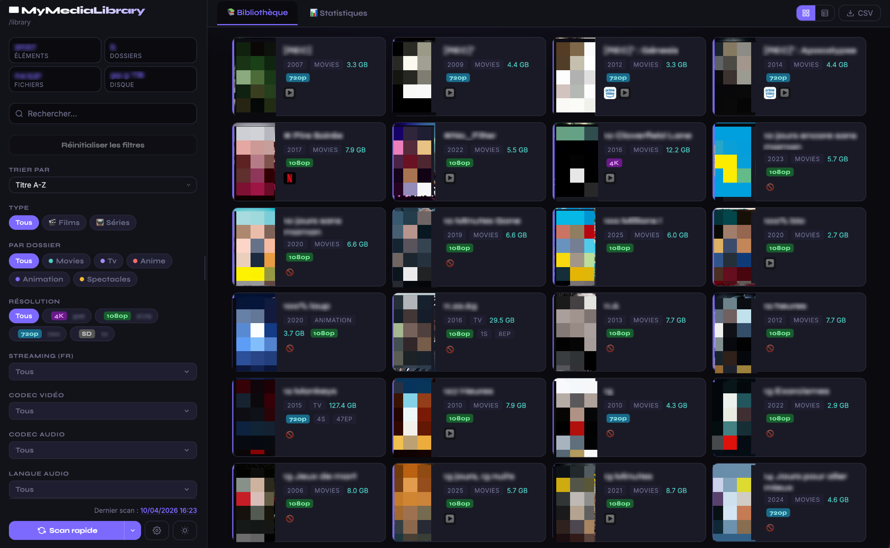
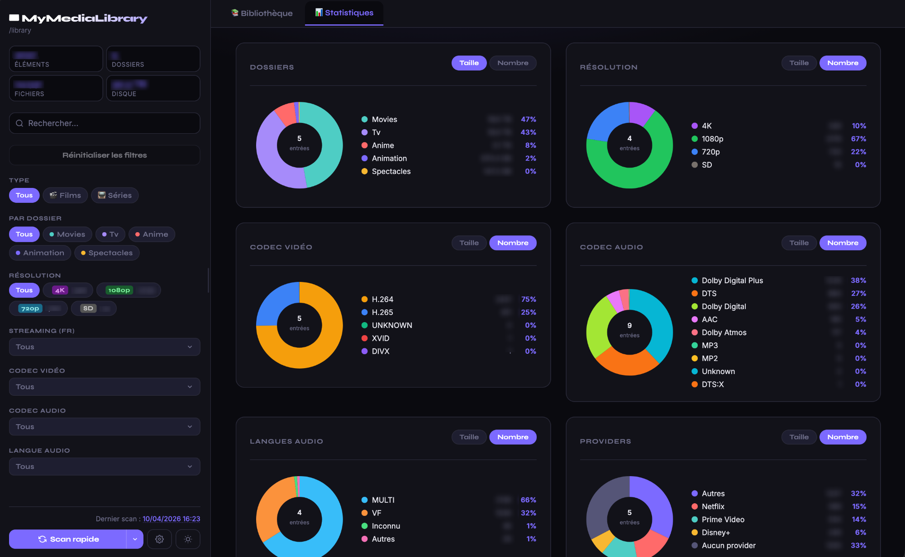

# 📼 MyMediaLibrary

  

---

**[Français](#français) | [English](#english)**

---

<a name="français"></a>
## 🇫🇷 Français

Tableau de bord auto-hébergé pour visualiser votre bibliothèque de films et séries. Scanne les fichiers `.nfo` (Kodi/Jellyfin/Emby), affiche une interface web filtrée, tourne dans un unique conteneur Docker. _Projet développé en vibe-coding avec l’aide de l’IA._

**→ [Documentation complète](docs/fr.md)**

### Fonctionnalités

- **Bibliothèque unifiée** : visualisation de vos films et séries en vue grille ou tableau, avec posters, métadonnées et informations techniques (résolution, codec vidéo/audio, HDR)
- **Filtres avancés** : système cohérent de dropdowns multi-sélection (dossiers, résolution, langues, codecs, plateformes) avec mode inclure/exclure, bouton "Tout sélectionner", tri dynamique par volume et persistance
- **Disponibilités streaming** : enrichissement via Seerr pour afficher les plateformes sur lesquelles chaque titre est disponible (Netflix, Canal+, etc.)
- **Statistiques** : camemberts et courbe temporelle sur la composition de la bibliothèque (groupes, résolution, codecs, plateformes, langues audio)
- **Scan configurable** : scan rapide (local uniquement) ou scan complet (avec Seerr), planifiable via cron, configurable depuis l'interface
- **Score qualité (optionnel)** : activez un système de scoring configurable (poids, règles, pénalités) directement depuis les paramètres, avec des valeurs par défaut prêtes à l’emploi
- **Recommandations intelligentes** : pistes concrètes pour améliorer qualité, espace disque et cohérence de la médiathèque
- **Interface bilingue** : interface entièrement disponible en français et en anglais, thème clair/sombre, responsive

### Recommandations

MyMediaLibrary ne se limite plus à analyser votre médiathèque : il propose désormais des recommandations concrètes pour l'améliorer.

Pipeline de scan : filesystem + NFO → enrichissement Seerr → score qualité → inventaire → recommandations.

Types de recommandations :
- **Qualité** : score faible, codecs anciens, audio insuffisant
- **Gain de place** : fichiers trop lourds, bitrate élevé, encodage inefficace
- **Langues** : absence de français, VO uniquement, sous-titres manquants
- **Séries** : saisons incohérentes, saison de qualité inférieure, saison anormalement volumineuse
- **Données** : champs manquants ou non détectés

### Démarrage rapide

```yaml
# compose.yaml
services:
  mymedialibrary:
    image: ghcr.io/mymedialibrary/mymedialibrary:latest
    container_name: mymedialibrary
    ports:
      - "8094:80"
    volumes:
      - ./data:/data
      - ./conf:/conf
      - /chemin/vers/ta/mediatheque:/library:ro
    environment:
      TZ: Europe/Paris
      # SEERR_URL: "http://seerr:5055"
      # SEERR_API_KEY: "your-seerr-api-key"
    restart: unless-stopped
```

```bash
mkdir mymedialibrary && cd mymedialibrary && mkdir data conf
# créer compose.yaml ci-dessus, puis :
docker compose up -d
```

Accéder à `http://localhost:8094` — un assistant de configuration s'affiche au premier démarrage.
L'authentification par mot de passe se configure dans cet assistant, puis dans **Paramètres > Configuration**. Le mot de passe n'est jamais passé par variable d'environnement et seul son hash est stocké dans `/conf/.secrets`.

Stockage runtime :
- `./data` contient les fichiers générés (`library.json`, inventaire, recommandations, `scanner.log`)
- `./conf` contient la configuration persistante (`config.json`, providers, règles, `.secrets`)
- `/library` est le point de montage fixe des médias dans le conteneur
- `/tmp` reste interne au conteneur et n'est pas à monter

Les anciens fichiers de configuration sont migrés automatiquement au démarrage :
`/data/config.json` → `/conf/config.json`, `/data/providers_mapping.json` → `/conf/providers_mapping.json`, `/data/providers_logo.json` → `/conf/providers_logo.json`, `/data/recommendations_rules.json` → `/conf/recommendations_rules.json` et `/app/.secrets` → `/conf/.secrets`. En cas de conflit entre source legacy et destination, l'application refuse de démarrer pour éviter tout écrasement.

> Le cron de scan automatique et le niveau de log se configurent dans **Paramètres > Système**.

### Mise à jour

```bash
docker compose pull && docker compose up -d
```

### Scan sécurité (Grype)

```bash
docker build -t mymedialibrary:local -f docker/Dockerfile .
grype mymedialibrary:local
```

> Workflow CI optionnel: **Security Scan (Grype)** s’exécute chaque semaine (et en manuel) puis publie les rapports table/JSON en artifacts.

### Contribution & Licence

Contributions bienvenues — ouvrez une issue ou une PR. Licence MIT.

---

<a name="english"></a>
## 🇬🇧 English

Self-hosted dashboard for visualizing your movie and TV library. Scans `.nfo` files (Kodi/Jellyfin/Emby), serves a filterable web interface, runs in a single Docker container. _Built using vibe coding with AI assistance._

**→ [Full documentation](docs/en.md)**

### Features

- **Unified library**: browse your movies and TV shows in grid or table view, with posters, metadata, and technical details (resolution, video/audio codec, HDR)
- **Advanced filters**: consistent multi-select dropdown system (folders, resolution, languages, codecs, providers) with include/exclude mode, "Select all", dynamic count sorting, and persistence
- **Streaming availability**: Seerr enrichment to show on which platforms each title is available (Netflix, Canal+, etc.)
- **Statistics**: pie charts and timeline on library composition (groups, resolution, codecs, providers, audio languages)
- **Configurable scan**: quick scan (local only) or full scan (with Seerr), schedulable via cron, configurable from the UI
- **Quality score (optional)**: enable a fully configurable scoring system from settings (weights and rules for video/audio/languages/size), with ready-to-use default values
- **Smart recommendations**: concrete suggestions to improve quality, disk usage, and library consistency
- **Bilingual interface**: fully available in French and English, light/dark theme, responsive

### Recommendations

MyMediaLibrary no longer only analyzes your media library: it can now suggest concrete actions to improve it.

Scan pipeline: filesystem + NFO → Seerr enrichment → quality score → inventory → recommendations.

Recommendation types:
- **Quality**: low score, legacy codecs, limited audio
- **Space saving**: oversized files, high bitrate, inefficient encoding
- **Languages**: missing French audio, original version only, missing subtitles
- **Series**: inconsistent seasons, lower-quality season, abnormally large season
- **Data**: missing or undetected fields

### Quick start

```yaml
# compose.yaml
services:
  mymedialibrary:
    image: ghcr.io/mymedialibrary/mymedialibrary:latest
    container_name: mymedialibrary
    ports:
      - "8094:80"
    volumes:
      - ./data:/data
      - ./conf:/conf
      - /path/to/your/library:/library:ro
    environment:
      TZ: Europe/Paris
      # SEERR_URL: "http://seerr:5055"
      # SEERR_API_KEY: "your-seerr-api-key"
    restart: unless-stopped
```

```bash
mkdir mymedialibrary && cd mymedialibrary && mkdir data conf
# create compose.yaml above, then:
docker compose up -d
```

Open `http://localhost:8094` — a setup wizard appears on first launch.
Password authentication is configured in that wizard, then in **Settings > Configuration**. The password is never passed through an environment variable and only its hash is stored in `/conf/.secrets`.

Runtime storage:
- `./data` contains generated files (`library.json`, inventory, recommendations, `scanner.log`)
- `./conf` contains persistent configuration (`config.json`, providers, rules, `.secrets`)
- `/library` is the fixed media mount point inside the container
- `/tmp` stays internal to the container and should not be mounted

Old configuration files are migrated automatically on startup:
`/data/config.json` → `/conf/config.json`, `/data/providers_mapping.json` → `/conf/providers_mapping.json`, `/data/providers_logo.json` → `/conf/providers_logo.json`, `/data/recommendations_rules.json` → `/conf/recommendations_rules.json`, and `/app/.secrets` → `/conf/.secrets`. If a legacy source and destination conflict, startup stops to avoid overwriting user configuration.

> Auto-scan schedule and log level are configured in **Settings > System**.

### Updating

```bash
docker compose pull && docker compose up -d
```

### Security scan (Grype)

```bash
docker build -t mymedialibrary:local -f docker/Dockerfile .
grype mymedialibrary:local
```

> Optional CI workflow: **Security Scan (Grype)** runs weekly and on manual trigger, then publishes table/JSON reports as artifacts.

### Contributing & License

Contributions welcome — open an issue or PR. MIT licensed.
